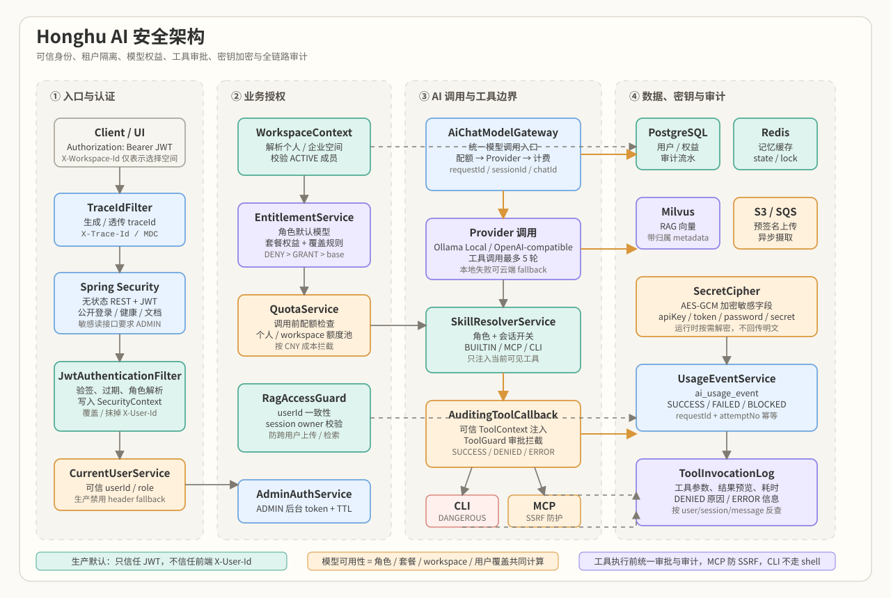

# Honghu AI 安全架构

> 本文说明 Honghu AI 在认证鉴权、模型访问、RAG 数据隔离、技能工具执行、密钥保护、审计追踪和运行配置上的安全设计。  
> 目标不是堆安全名词，而是解释一次用户请求从进入系统到调用大模型、检索知识库、执行工具、落审计流水的过程中，哪些身份可信、哪些输入不可信、哪些动作必须被拦截或记录。



## 1. 安全目标

Honghu AI 是一个面向多模型聊天、RAG 知识库和技能工具调用的 AI 应用平台。它的风险面不只来自普通 Web API，还来自大模型可以间接触发的工具调用、外部 Provider 调用、用户上传文档和第三方 MCP 端点。因此安全架构围绕以下目标设计：

1. **身份可信**：后端不信任前端传入的 `X-User-Id`，生产默认只信任服务端签发并验签通过的 JWT。
2. **权限分层**：用户身份、管理员身份、workspace 成员关系、模型权益、技能权限、工具审批分别在对应边界校验。
3. **租户隔离**：用户只能访问自己或自己所属 workspace 下的数据、RAG 文档、会话和配额池。
4. **AI 成本可控**：模型调用前做配额检查，模型选择必须经过权益过滤，调用成功/失败/拦截都写入用量流水。
5. **工具调用可控**：所有模型可见工具在执行前统一经过 `AuditingToolCallback` 和 `ToolGuard`，危险工具需要会话级审批。
6. **出站访问受限**：远程 MCP 默认拒绝私网、环回、链路本地和云元数据地址，降低 SSRF 风险。
7. **密钥不明文落库**：Provider key、MCP token 等敏感字段通过 AES-GCM 加密保存，运行时按需解密。
8. **全链路可追踪**：HTTP 请求、AI 调用、工具调用和用量事件都带 request/trace 上下文，方便审计和排障。

## 2. 总体安全模型

系统将安全控制拆成五层：

| 层级 | 关键组件 | 安全职责 |
|---|---|---|
| 边界入口层 | `SecurityConfig`, `JwtAuthenticationFilter`, `TraceIdFilter` | CORS、JWT 验签、请求身份封装、traceId/requestId 注入 |
| 身份与角色层 | `JwtService`, `CurrentUserService`, `AdminAuthService` | 用户 JWT、游客身份、管理员会话、角色解析 |
| 业务授权层 | `WorkspaceContextService`, `EntitlementService`, `AiModelAccessService`, `RagAccessGuard`, `QuotaService` | workspace 成员校验、模型白名单、RAG 所有权、配额拦截 |
| AI 执行层 | `AiChatModelGatewayService`, `OpenAiCompatibleChatClient`, `SkillResolverService`, `AuditingToolCallback`, `ToolGuard` | Provider 调用、工具上下文注入、危险工具审批、工具审计 |
| 数据与审计层 | PostgreSQL, Redis, Milvus, S3/SQS, `UsageEventService`, `ToolInvocationLog` | 用量流水、工具日志、密钥密文、RAG 元数据与向量数据 |

一个重要原则是：**模型只能控制自然语言内容和工具参数，不能控制用户身份、sessionId、messageId、workspaceId 这类安全上下文**。这些字段由后端从 JWT、请求上下文和数据库关系中解析后，通过 `AiCallContext` 和 Spring AI `ToolContext` 注入到调用链中。

## 3. 请求入口与认证

### 3.1 TraceId 优先进入链路

`TraceIdFilter` 使用最高优先级执行，在请求刚进入应用时生成或透传：

- `X-Trace-Id`
- `X-Request-Id`

这两个值会写入 SLF4J MDC，并通过响应头 `X-Trace-Id` 返回给前端。日志格式中包含 `%X{traceId}`，因此即使是认证失败、权限拒绝或上游模型异常，也能用同一个 traceId 串起 Controller、Gateway、Provider、Billing 和 Tool 调用日志。

### 3.2 Spring Security 无状态认证

`SecurityConfig` 的安全策略是：

- REST API 使用无状态 JWT，`SessionCreationPolicy.STATELESS`。
- CSRF 关闭，适配纯 API + Bearer Token 模式。
- 登录、注册、健康检查、Swagger、Prometheus 等基础端点放行。
- 用户列表等管理读接口在框架层要求 `ROLE_ADMIN`。
- 其余业务接口保留产品上的游客体验，具体用户级授权由业务层守卫兜底。

当前配置中特别需要注意：

- 生产默认 `app.security.dev-header-fallback=false`。
- 只有本地联调时才建议临时打开 `APP_SECURITY_DEV_HEADER_FALLBACK=true`。
- CORS 当前允许通配来源并允许凭证，适合本地和演示环境；生产环境应收紧为明确前端域名。

### 3.3 JWT 签发与验签

`JwtService` 使用 HS256 签发 JWT：

- `sub`：用户 ID。
- `username`：登录名，用于日志展示。
- `role`：平台角色，如 `GUEST`、`USER`、`VIP`、`ADMIN`。
- `issuer`：默认 `honghu-ai`。
- `expiration`：默认 8 小时，可通过 `APP_SECURITY_JWT_TTL_HOURS` 配置。

JWT secret 通过 `APP_SECURITY_JWT_SECRET` 注入，启动时校验长度至少 32 字节，避免弱 HMAC key。用户登录、注册和微信登录成功后，统一通过 `UserController.buildLoginResponse()` 返回 `token`、`tokenType` 和 `tokenExpiresAt`。

### 3.4 可信身份覆盖旧请求头

历史接口中仍有部分 Controller 使用 `X-User-Id`。为了避免大改所有签名，同时消除“前端随便填 userId 就越权”的问题，`JwtAuthenticationFilter` 做了两件事：

1. 如果 `Authorization: Bearer <jwt>` 验签成功，构造 `JwtPrincipal` 写入 `SecurityContext`。
2. 用 `TrustedHeaderRequestWrapper` 将下游看到的 `X-User-Id` 强制改写为 JWT 里的可信 `userId`。

如果没有有效 JWT 且关闭了 dev fallback，则包装器会抹掉伪造的 `X-User-Id`，下游只能按匿名或游客处理。

## 4. 用户、管理员与角色模型

### 4.1 普通用户身份

普通用户使用 `UserService.authenticate()` 校验用户名密码。密码策略如下：

- 新注册用户一律使用 BCrypt 加盐哈希落库。
- 历史明文密码兼容登录，但登录成功后立即升级为 BCrypt。
- 微信登录用户使用随机不可用密码填充，避免空密码或弱默认密码。

`CurrentUserService` 是业务层读取当前用户的统一入口。它优先读取 `SecurityContext` 中的 `JwtPrincipal`，再回库读取最新用户数据，避免仅凭 token 中的旧角色做长期授权判断。

### 4.2 游客身份

平台允许游客体验。游客用户不落库，`userId` 固定为 `guest`，角色为 `GUEST`。游客能看到和使用的模型、技能由角色规则限制，不能解析用户安装的 MCP 技能，也不会拥有用户级私有配置。

### 4.3 管理员后台身份

后台管理接口当前由 `AdminAuthService` 单独维护管理员会话：

- 管理员用普通账号密码登录后台。
- 只有 `UserRole.ADMIN` 能登录成功。
- 后端生成 32 字节安全随机 token，返回给前端作为 Bearer token。
- 内存中只保存 token 的 SHA-256 摘要，不保存明文 token。
- token TTL 为 8 小时。

这是为了兼容已有后台接口。长期演进方向是将后台 token 收敛到统一 JWT 或外部 IdP，但当前实现已经具备最小可用的管理员认证和过期机制。

## 5. Workspace 与租户隔离

Honghu AI 使用 workspace 表达个人空间和企业空间。`WorkspaceContextService` 负责：

- 注册后为用户创建个人 organization、workspace、成员关系和默认 workspace。
- 每次请求解析实际 workspace。
- 校验当前用户是否是该 workspace 的 `ACTIVE` 成员。

这意味着前端传入的 `X-Workspace-Id` 或请求体里的 workspaceId 只是“希望切换到哪个空间”的选择，不是授权凭证。后端会结合可信 `userId` 校验成员关系，校验失败则拒绝。

个人空间默认 `workspaceId = userId`。企业空间如果带有 `planCode`，模型权益和配额会按团队套餐计算；否则按用户角色计算。

## 6. 模型访问控制

AI 模型是成本和权限的核心资产，不能只靠前端隐藏按钮。平台用 `EntitlementService` 统一计算“当前用户此刻能用哪些模型”。

模型权益来源分四层：

1. **角色默认模型**：个人空间下，根据 `role_model_default` 决定基础可用模型。
2. **企业套餐权益**：企业 workspace 下，根据 `plan_entitlement` 的 `ALLOWED_MODEL` / `ALLOWED_PROVIDER` 决定可用模型。
3. **workspace 上下文**：不同 workspace 可以对应不同权益和配额池。
4. **用户级覆盖**：`user_model_permission` 支持 `GRANT` / `DENY`，且 `DENY > GRANT > base rules`。

`AiModelAccessService.resolveModelForChat()` 会对显式选择模型、自动路由模型、默认模型和兜底模型逐一做可访问性检查。用户无权使用的模型不会进入实际调用链。

本地模型不可用时，网关可以回退到云端模型，但回退目标也必须是已启用模型；在用户级回退选择里，还会优先从当前用户可访问模型中选择云端模型，避免通过 fallback 绕过模型授权。

## 7. 配额、计费与用量审计

`AiChatModelGatewayService` 是所有 AI 模型调用的统一入口。它在调用上游模型前后执行以下安全动作：

1. 准备 `AiCallContext`，补齐 requestId、userId、workspaceId、sessionId、chatId。
2. 解析最终执行模型和 Provider。
3. 调用 `QuotaService.checkBeforeCall()` 做配额检查。
4. 调用上游本地模型或 OpenAI-compatible Provider。
5. 使用 `BillingService` 根据 token usage 和价格快照计算成本。
6. 通过 `UsageEventService` 写入 `ai_usage_event`。

配额策略：

- 个人空间按 `userId + workspaceId` 聚合用量。
- 企业空间按 `workspaceId` 聚合团队共享用量。
- 拦截口径以 CNY 成本为准，标准 token 只是展示折算。
- 当前采用“软拦截”：调用前根据已成功费用判断是否达到上限，不做预扣。

用量流水策略：

- 成功：写 `SUCCESS`、token、成本、模型、provider、latency。
- 配额拦截：写 `BLOCKED_BY_QUOTA`，费用为 0。
- 缺价格配置：写 `BLOCKED_BY_PRICING`，费用为 0。
- 上游失败：写 `FAILED`，费用为 0。
- `requestId + attemptNo` 作为幂等键，避免流式回调或异常链重复记账。
- 使用 `REQUIRES_NEW` 事务，尽量保证外层聊天事务失败时仍能留下审计记录。

这些流水既是成本账本，也是安全审计事实来源。

## 8. RAG 数据安全

RAG 风险主要有两类：文档所有权越权、以及文档内容中的 prompt injection。项目分别做了边界控制。

### 8.1 上传与会话归属

`RagAccessGuard` 集中处理 RAG 调用者校验：

- 请求必须能解析到真实用户。
- path/body 中的目标 userId 必须与可信调用者一致。
- 访问已有 session 时，session 必须归属当前用户。
- 创建或复用 session 时，如果发现 session 已属于其他用户，直接拒绝。

并发创建同一个 sessionId 时，通过唯一键异常后重新查询并再次校验归属，避免竞态下把文件挂到他人会话。

### 8.2 检索作用域

RAG 检索接口按 `userId`、`sessionId`、`chatId`、附件 fileId 等上下文构造 `RagRequest`。检索结果会携带 `ChunkMetadata`，上层可以基于文档、会话、附件范围做过滤和 fallback。

默认检索链路支持：

- 当前附件优先。
- 当前对话 / 当前会话范围 fallback。
- 关键词 / 向量召回。
- RRF 融合和作用域兜底（按配置启用）。

这些设计保证知识库不是“全局向量库随便搜”，而是按用户和会话上下文收敛。

### 8.3 Prompt Injection 边界

`RagRetrievalService` 将外部资料包裹在：

- `<<<RAG_DOC_BEGIN>>>`
- `<<<RAG_DOC_END>>>`

RAG 文档作为资料上下文注入，而不是系统指令本身。这个边界不能完全消灭 prompt injection，但可以让 prompt 模板明确区分“系统规则”和“用户上传资料”，并为后续引用检查、内容标注和安全过滤留出位置。

## 9. 技能与工具调用安全

技能系统是项目中最需要防守的 AI 安全面。因为模型一旦能调用工具，就可能产生外部副作用、泄露数据或触发高风险操作。Honghu AI 将所有工具来源统一收敛到一条运行时边界。

### 9.1 工具解析策略

`SkillResolverService` 负责计算某个用户/会话最终可见的工具集：

- 根据可信 `userId` 回库读取角色。
- 使用 `SkillAccessPolicy` 计算当前角色可以使用哪些 `requiredRole` 技能。
- 合并 mandatory 技能、defaultEnabled 技能、用户已安装技能和会话级开关。
- 按来源解析为工具回调：`BUILTIN`、`MCP`、`CLI`。
- 所有工具统一包装为 `AuditingToolCallback`。

会话级开关优先级高，但 mandatory 技能不能被会话关闭。全局 `enabled=false` 的技能即使曾经安装，也不会被注入给模型。

### 9.2 可信上下文注入

模型调用工具时只能生成工具参数 JSON。以下字段不会从模型参数中读取：

- `userId`
- `sessionId`
- `messageId`
- `query`

这些字段由 `AiChatModelGatewayService.buildToolContext()` 从 `AiCallContext` 构造，并作为 Spring AI `ToolContext` 传给每个工具。`AuditingToolCallback` 再将其转成 `ToolExecutionContext`，供内置工具和审计日志使用。

这条边界很关键：模型不能通过工具参数伪造自己是另一个用户，也不能伪造另一个 session 的审批状态。

### 9.3 统一审计装饰器

`AuditingToolCallback` 是所有模型可见工具的统一安全装饰器。它在执行前后做四件事：

1. 规范化模型生成的 JSON 参数，非法 JSON 兜底为 `{}`。
2. 调用 `ToolGuard` 检查危险等级和审批状态。
3. 将可信上下文放入 `ToolExecutionContextHolder`，执行后在 `finally` 清理，避免线程复用串号。
4. 无论成功、失败还是拒绝，都写入 `tool_invocation_log`。

审计字段包括：

- userId
- sessionId
- messageId
- skillId
- toolQualifiedName
- arguments
- resultPreview
- durationMs
- status：`SUCCESS` / `DENIED` / `ERROR`
- errorMessage

工具返回结果只保存预览，避免大段外部响应撑爆日志表。

### 9.4 危险等级与审批

工具危险等级由 `DangerLevel` 表达：

- `SAFE`：当前直接放行。
- `CAUTION`：当前直接放行，但保留审计和元数据，适合未来加警告或限流。
- `DANGEROUS`：必须有当前会话中精确工具名匹配的有效审批记录。

`ToolGuard` 对 `DANGEROUS` 工具要求：

- 必须存在 `sessionId`。
- `session_tool_approval` 中必须有未过期审批。
- 审批匹配 `toolQualifiedName`，避免批准 A 工具后误放行 B 工具。

如果未审批，工具不会进入真实执行器，而是返回结构化 `DENIED` JSON 给模型。

## 10. MCP 出站安全

远程 MCP 工具由 `McpSkillProvider` 处理。它当前只支持远程 HTTP JSON-RPC MCP，明确拒绝本地 `stdio` MCP，因为 stdio 需要启动用户控制的本地进程，必须先具备更强沙箱和审批机制。

MCP 安全措施：

- 只有用户已安装且启用的 MCP 技能才会解析。
- `guest` 用户不能解析 MCP。
- 用户安装配置中的 token、apiKey、authorization 等敏感字段解密后只在内存使用。
- `tools/list` 结果短期缓存，避免每轮聊天反复请求远程端点。
- `tools/call` 返回结果会截断，避免超大对象进入模型上下文。
- 单个 MCP 加载失败只跳过该技能，不影响正常聊天。

SSRF 防护：

- 仅允许 `http` / `https` scheme。
- 默认拒绝环回地址、任意本地地址、链路本地地址、私网地址、组播地址。
- 拒绝 IPv6 unique local `fc00::/7`。
- DNS 解析出的所有 IP 都必须通过校验，避免域名解析到内网绕过。
- 默认不允许访问 `169.254.169.254` 等云元数据地址。

如果是受控内网部署，可以显式设置 `app.skill.mcp.allow-private-endpoints=true`，但这会扩大 SSRF 风险，必须配合网络层 egress policy。

## 11. CLI 工具安全

CLI 工具由 `CliSkillProvider` 和 `SandboxedCommandRunner` 处理。项目没有暴露任意 shell，而是采用极窄白名单：

- 允许命令：`git`、`npm`。
- 允许子命令：
  - `git status/diff/log/branch/show`
  - `npm test/run/list/view`
- `npm run` 进一步限制为 `test/build/lint`。
- 不使用 `sh -c`、`cmd /c` 或整段 shell 字符串。
- 使用 `ProcessBuilder` 逐项传 argv，降低 shell 元字符注入风险。
- 固定工作目录。
- 拒绝包含换行、回车、NUL 的参数。
- 有墙钟超时，超时强杀。
- 输出截断。

所有 CLI 工具都标记为 `DANGEROUS`，即使是只读命令，也必须由当前会话审批后才能执行。原因是 CLI 可能读取本地路径、仓库状态、源码片段和环境信息。

这不是完整容器级沙箱，生产环境如果要开放更强 CLI 能力，应引入容器隔离、只读文件系统、网络隔离、资源限制和更细的审计策略。

## 12. 密钥与敏感配置保护

项目中的敏感信息主要有三类：

- 用户密码。
- AI Provider API Key。
- 技能 / MCP 安装配置中的 token、apiKey、password、secret、credential、authorization。

保护策略：

| 数据 | 保护方式 |
|---|---|
| 用户密码 | BCrypt 加盐哈希；历史明文登录后自动升级 |
| JWT 签名密钥 | 环境变量 `APP_SECURITY_JWT_SECRET` 注入；启动校验长度 |
| Provider API Key | 数据库 provider key 使用 `SecretCipher.encryptSecret()` 加密；运行时解密 |
| MCP/技能配置密钥 | `SecretCipher.encryptConfigToJson()` 递归加密敏感字段 |
| 后台 token | 只在内存保存 SHA-256 摘要，不保存明文 |
| 外部配置密钥 | application.yml 只保留环境变量占位，避免真实密钥入库 |

`SecretCipher` 使用 AES-GCM：

- 96-bit 随机 IV。
- 128-bit GCM tag。
- PBKDF2WithHmacSHA256 派生 256-bit AES key。
- 加密值带 `enc:v1:` 前缀，方便后续版本迁移。
- 生产环境应通过 `APP_SKILL_SECRET_KEY` 配置稳定密钥，并关闭 dev fallback。

## 13. 外部 Provider 调用边界

`OpenAiCompatibleChatClient` 负责调用外部 OpenAI-compatible Provider。它的安全边界包括：

- Provider 必须启用、配置 baseUrl、path 和必要 API Key。
- API Key 从配置或数据库 Provider 解析，不由模型提供。
- function calling 最多循环 `MAX_TOOL_ROUNDS=5`，避免模型和工具无限循环。
- 工具不存在或执行失败时返回结构化错误给模型，不直接让整个聊天链路失控。
- 流式调用支持 client cancel，下游 OkHttp call 会被取消。
- 上游失败会被包装并写入 usage event。

当前 Provider baseUrl 没有做类似 MCP 的私网拦截，因为 Provider 管理通常属于后台管理能力。生产环境如果允许管理员动态新增 Provider，建议增加 Provider endpoint allowlist，防止误配到内网服务。

## 14. 数据存储安全边界

### PostgreSQL

PostgreSQL 保存用户、workspace、模型权益、计费价格、用量流水、技能目录、工具审计和 RAG 元数据。安全设计重点：

- 用 Liquibase 管理 schema。
- 密码和敏感配置不明文保存。
- usage event 和 tool invocation log 作为审计事实来源。
- workspace 成员关系在业务层统一校验。

### Redis

Redis 用于短期记忆、摘要缓存、分布式锁和微信登录 state 等短生命周期数据。安全设计重点：

- TTL 控制短期上下文生命周期。
- 微信登录 state 一次性、短 TTL，用于防 CSRF。
- 生产环境必须启用 Redis 密码、网络隔离和非公网访问。

### Milvus

Milvus 保存 RAG 向量索引。安全设计重点：

- 向量检索不应作为全局裸搜入口。
- 检索必须带 user/session/attachment/workspace 上下文过滤。
- chunk metadata 中保留 document/session/user/file 归属信息，供检索 pipeline 过滤。

### S3/SQS

S3 保存用户上传文档和头像，SQS 驱动异步摄取。安全设计重点：

- 上传使用预签名 URL，并设置过期时间。
- 文档摄取后必须落用户、session 和文件归属元数据。
- 生产环境应使用最小权限 IAM，只允许访问指定 bucket/prefix 和 queue。

## 15. 可观测性与安全审计

项目同时保留业务审计和指标观测：

| 类型 | 数据源 | 用途 |
|---|---|---|
| HTTP trace | `TraceIdFilter`, MDC, `X-Trace-Id` | 报障定位、日志串联 |
| AI 用量流水 | `ai_usage_event` | 成本、配额、失败原因、模型调用审计 |
| 工具调用日志 | `tool_invocation_log` | 工具参数、结果预览、拒绝/失败原因 |
| Prometheus 指标 | `GatewayMetrics`, `/actuator/prometheus` | QPS、时延、TTFT、token、成本、状态 |
| RAG pipeline 指标 | `RagPipelineMetrics` | 召回、fallback、检索质量排查 |

安全排查时通常从 `X-Trace-Id` 开始，然后关联：

1. 应用日志中的 traceId。
2. `ai_usage_event.request_id`。
3. `tool_invocation_log.session_id/message_id`。
4. workspace、user、model、provider、status 字段。

## 16. 典型攻击面与缓解

| 攻击面 | 风险 | 当前缓解 |
|---|---|---|
| 伪造 `X-User-Id` | 冒充他人访问会话或文档 | JWT 验签后覆盖身份头；生产默认关闭 header fallback |
| 篡改 JWT | 冒充用户或提升角色 | HS256 签名、过期时间、issuer、启动校验 secret 长度 |
| 普通用户访问管理接口 | 用户数据泄露或后台操作 | Spring Security `ROLE_ADMIN` + `AdminAuthService` |
| 切换他人 workspace | 使用他人套餐、读取他人数据 | `WorkspaceContextService` 校验 active member |
| 调用未授权高价模型 | 成本失控或权限绕过 | `EntitlementService` + `AiModelAccessService` |
| 配额绕过 | 超额调用外部模型 | `QuotaService.checkBeforeCall()` + usage event |
| RAG 会话越权 | 读取他人上传资料 | `RagAccessGuard` 校验 user/session owner |
| Prompt injection | 文档内容伪装系统指令 | RAG block 边界、资料上下文与系统指令分离 |
| MCP SSRF | 访问 localhost、内网、云元数据 | scheme 校验、DNS 全 IP 检查、私网/链路本地默认拒绝 |
| CLI 命令注入 | 任意命令执行 | 不走 shell、命令/子命令白名单、参数控制字符过滤 |
| 危险工具误执行 | 删除/泄露/外部副作用 | `DANGEROUS` 工具会话级审批 |
| 工具身份伪造 | 模型通过参数伪造 userId/sessionId | userId/sessionId 由后端 ToolContext 注入 |
| 密钥泄露 | Provider/MCP key 明文入库 | AES-GCM 加密敏感字段 |
| 审计缺失 | 事后无法定位 | usage event、tool log、traceId |

## 17. 生产部署安全配置建议

本项目默认配置兼顾本地开发和演示。生产部署前建议至少调整：

```yaml
app:
  security:
    dev-header-fallback: false
    jwt:
      secret: ${APP_SECURITY_JWT_SECRET}
      ttl-hours: 8

  skill:
    allow-dev-secret-fallback: false
    secret-key: ${APP_SKILL_SECRET_KEY}
    mcp:
      allow-private-endpoints: false
```

同时建议：

- 将 CORS `allowedOriginPatterns("*")` 收紧为正式前端域名。
- 不在 `application.yml`、`.env`、README 中提交真实 API Key。
- 数据库、Redis、Milvus、S3、SQS 均放在私有网络或受控安全组内。
- Provider baseUrl 使用 allowlist。
- 管理后台接口接入统一 JWT 或企业 IdP。
- 为 `actuator/prometheus` 配置网络层访问控制，不直接暴露公网。
- 生产关闭详细错误堆栈，避免返回上游密钥、endpoint 或内部路径。
- CLI 工具如需开放给真实用户，使用容器沙箱、只读挂载、网络隔离和资源限制。

## 18. 已知边界与后续加固计划

当前安全架构已经覆盖应用层主要风险，但仍有明确边界：

1. **SecurityConfig 仍保留部分业务接口 permitAll**  
   这是为了兼容游客体验和历史接口。后续可以逐步将敏感写接口收敛到 `authenticated()`，并通过 `CurrentUserService.requireUser()` 明确拒绝匿名。

2. **管理员后台 token 仍是内存会话**  
   单实例可用，多实例会话不共享。后续建议统一到 JWT、Redis session 或企业 IdP。

3. **CORS 默认较宽**  
   本地开发方便，但生产应限定前端域名。

4. **Provider endpoint 未做 SSRF allowlist**  
   MCP 已做出站防护，Provider 仍信任后台配置。后续建议对 Provider baseUrl 增加 allowlist 或私网拒绝策略。

5. **RAG prompt injection 不是完全解决**  
   当前通过资料边界和格式化降低风险。后续可增加引用约束、文档内容安全分类、敏感指令过滤和回答引用校验。

6. **CLI 沙箱不是容器隔离**  
   当前是不走 shell + 白名单 + 审批 + 超时。生产开放任意用户 CLI 前，必须引入 OS/container 级隔离。

7. **JWT 暂未实现撤销列表**  
   token 过期前无法主动失效。后续可以引入 token version、Redis denylist 或短 token + refresh token。

## 19. 面试/项目讲法

如果需要用一句话概括本项目安全架构：

> Honghu AI 的安全边界不是只做登录，而是把“可信身份”和“模型可控输入”彻底分开：JWT 和 workspace 决定用户能访问什么，Entitlement 和 Quota 决定能调用什么模型，ToolContext 和 ToolGuard 决定模型能执行什么工具，所有 AI 调用和工具调用都会落用量与审计流水，出问题可以按 traceId 反查。

如果需要展开，可以按这条链路讲：

1. 请求进入时生成 traceId。
2. JWT 验签得到可信 userId/role，并覆盖历史 `X-User-Id`。
3. workspace 成员校验决定租户上下文。
4. Entitlement 决定可用模型，Quota 决定是否能继续调用。
5. AI Gateway 统一调用本地或云端 Provider，并记录 usage event。
6. 技能系统只把当前用户/会话允许的工具注入模型。
7. 工具执行前经过审计装饰器和危险等级守卫。
8. MCP 做 SSRF 防护，CLI 做白名单和审批。
9. 密钥密文保存，审计流水可追踪。
