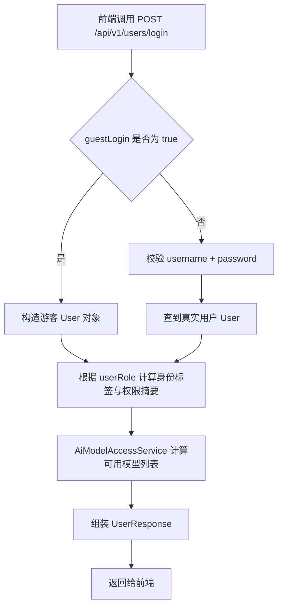
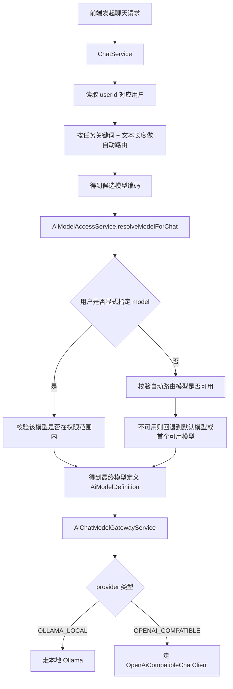
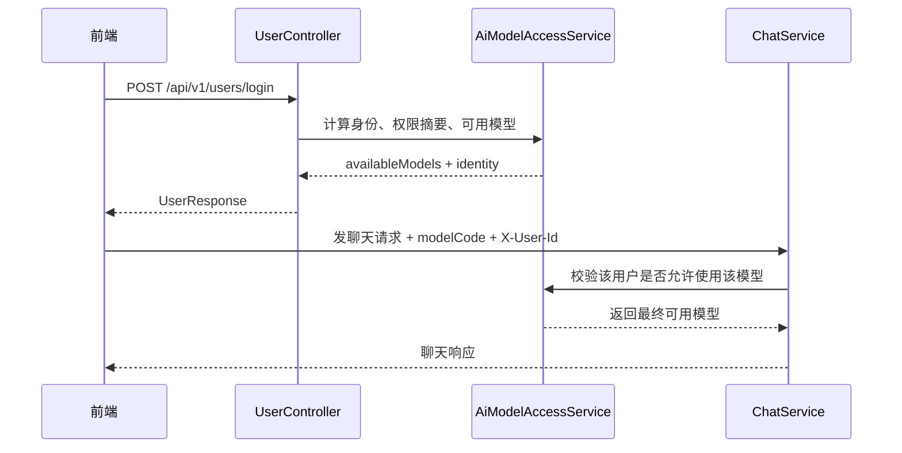

# 本次改动梳理：身份分层、模型权限、多 Provider 调用

> 这份文档不是给前端的，而是给项目维护者 / 你自己看的。
>
> 目标：尽量用通俗的话，把这次为什么要改、改了什么、代码怎么串起来，讲清楚。

---

# 1. 一句话先讲明白：这次到底改了什么？

以前系统更像是：

- 只有“用户”这个概念
- 模型选择主要靠后端内部路由
- 前端不太清楚“这个用户到底能不能用某个模型”
- 外部模型接入也还没有统一成一个清晰的配置/网关体系

这次改完以后，变成：

## 现在系统多了 3 层能力

### 第一层：身份分层
用户不再只有一种类型，而是分成：

- `GUEST` 游客
- `USER` 普通用户
- `VIP` VIP 用户
- `ADMIN` 管理员

每种身份默认能用的模型范围不一样。

---

### 第二层：模型目录与权限
系统里有哪些模型，不再散落在代码里，而是统一放进数据库表：

- 哪个模型叫什么
- 属于哪个 provider
- 是第一梯队还是第二梯队
- 是不是本地模型
- 支不支持流式

以及：

- 某个用户有没有被显式授权某些模型

---

### 第三层：统一模型调用网关
现在聊天时，不是直接写死“就调 Ollama”。
而是先判断：

1. 这个用户是什么身份？
2. 这个身份允许用哪些模型？
3. 用户有没有显式选择模型？
4. 没选的话系统自动路由到哪个模型？
5. 最终这个模型是本地 Ollama 还是外部 provider？
6. 再交给统一网关发请求

---

# 2. 为什么要这么改？

因为你现在的业务已经不是“单模型聊天”了，而是“多模型、分身份、分权限”的聊天系统。

如果不这么改，会有几个问题：

## 问题 1：前端不知道当前用户能用什么模型
比如一个普通用户登录后：

- 前端不知道该给他展示哪些模型
- 也不知道哪些模型要禁用
- 更不知道 VIP 用户为什么比普通用户多一些模型

所以现在改成：

### 登录时直接返回可用模型列表
这样前端拿到登录结果就能直接渲染。

---

## 问题 2：模型权限如果只靠前端判断，不安全
如果前端只是“自己隐藏某个模型按钮”，但后端不校验，那用户仍然可以手动传一个模型编码过来。

所以现在后端也会校验：

- 这个身份能不能用这个模型
- 这个用户有没有显式授权这个模型

这叫：

### 前后端双保险

---

## 问题 3：以后接更多模型会越来越乱
如果每加一个模型，就在 `ChatService` 里加一段 `if else`，代码会越来越难维护。

所以现在改成：

- 模型目录表负责“描述模型”
- 配置文件负责“描述 provider 怎么调”
- 网关服务负责“真正发请求”

这样以后加模型、换模型、换 key 都更容易。

---

# 3. 现在用户身份和权限规则是什么？

## 当前规则表

| 身份 | 含义 | 默认可用模型 |
|---|---|---|
| `GUEST` | 游客 | 本地 + 第二梯队模型 |
| `USER` | 普通用户 | 第二梯队模型 |
| `VIP` | VIP 用户 | 全部梯队模型 |
| `ADMIN` | 管理员 | 全部梯队模型 + 管理权限 |

---

## 这句话最重要

### 身份是“基线能力”
意思是：

- 游客天生就不该用第一梯队云模型
- 普通用户天生就不该用第一梯队模型
- VIP / ADMIN 天生就能用全部模型

---

### `user_model_permission` 是“进一步收口”
这张表不是用来突破身份上限的。

它的作用是：

- 在身份允许的范围内，再缩小成“这个人实际能用哪些模型”

比如：

- 一个 `VIP` 理论上能用全部模型
- 但如果权限表只给了他 `gpt-5.1`
- 那最后他就只能用 `gpt-5.1`

也就是：

```text
最终权限 = 身份基线能力 ∩ 显式授权集合
```

---

# 4. 这次新增了哪些表？

## 4.1 `ai_model_definition`
这张表是“模型目录表”。

可以理解成：

### 系统里的模型菜单

它描述了：

- 模型编码 `model_code`
- 展示名称 `display_name`
- 提供商 `provider_code`
- 真正请求上游时的名字 `api_model_name`
- 梯队 `level`
- 是否本地模型 `local_model`
- 是否支持流式 `supports_stream`
- 是否启用 `enabled`

---

## 4.2 `user_model_permission`
这张表是“用户显式授权表”。

可以理解成：

### 给某个用户开通哪些模型

里面会记录：

- `user_id`
- `model_code`
- `enabled`

---

## 4.3 `users.user_role`
原来的 `users` 表增加了 `user_role` 字段。

用于记录用户的身份：

- `GUEST`
- `USER`
- `VIP`
- `ADMIN`

---

# 5. 本次最核心的代码链路是怎样的？

下面我用图来讲。

---

## 5.1 登录链路图



---

## 5.2 聊天选模型链路图



---

# 6. 关键类分别是干什么的？

## 6.1 `UserController`
你可以把它理解为：

### 用户接口入口

这里最重要的是：

- `POST /api/v1/users/login`

现在登录返回的不只是基础用户信息，还会带：

- `identity`
- `identityLabel`
- `permissionSummary`
- `availableModels`

所以前端不需要再单独查权限接口了。

---

## 6.2 `UserResponse`
这个 DTO 现在承担了双重职责：

### 既是用户基础响应 DTO，也是登录返回 DTO

也就是说：

- 查询用户时，它能返回基础字段
- 登录时，它还能返回身份和模型权限字段

这也是你后来提的那个点：

> `UserResponse` 才应该是 login 返回

现在已经按这个思路收口了。

---

## 6.3 `AiModelAccessService`
这是权限判断的核心服务。

它主要做 4 件事：

### ① 查询所有模型目录
方法：
- `listAllEnabledModels()`

### ② 按身份算角色基线能力
方法内部：
- `listRoleScopedModels(...)`

比如：
- 游客 -> 本地 + 第二梯队
- 普通用户 -> 第二梯队
- VIP/admin -> 全部

### ③ 结合 `user_model_permission` 做交集
方法：
- `listAccessibleModels(...)`

### ④ 在聊天时决定最终能不能用某个模型
方法：
- `resolveModelForChat(...)`

---

## 6.4 `AiChatModelGatewayService`
这是模型调用网关。

你可以把它理解为：

### 最终拍板“这个模型应该怎么调”

如果是：

- 本地模型 -> 走 `OllamaChatModel`
- 外部模型 -> 走 `OpenAiCompatibleChatClient`

这样 `ChatService` 就不用自己关心每种 provider 怎么调用。

---

## 6.5 `OpenAiCompatibleChatClient`
这个类负责：

### 调用外部 OpenAI-compatible 接口

它做的事情包括：

- 组装请求 URL
- 注入 API Key
- 组装标准 `messages`
- 支持同步调用
- 支持流式调用
- 解析 SSE 风格返回

---

## 6.6 `ChatService`
这个类仍然是聊天主流程中心。

但现在它已经不是“直接调某个固定模型”了。

它会先：

1. 识别任务类型
2. 自动路由候选模型
3. 结合用户身份 / 权限确定最终模型
4. 再交给网关执行

也就是说：

### `ChatService` 负责业务流程
### `AiChatModelGatewayService` 负责真正调用模型

职责已经比以前更清晰了。

---

# 7. 关于你问的那个重点：DeepSeek 到底怎么配？

这个非常重要，我单独说。

## 7.1 DeepSeek 申请到的不是 SSH Key
而是：

### API Key

通常长得像：

```text
sk-xxxxxx
```

不是 SSH key。

---

## 7.2 DeepSeek 官方常见接法
如果你走 DeepSeek 官方平台，通常就是：

- `base-url`
- `api-key`
- `/v1/chat/completions`

也就是配置文件里这个：

```yaml
app:
  ai:
    providers:
      deepseek-cloud:
        type: OPENAI_COMPATIBLE
        enabled: true
        base-url: https://api.deepseek.com
        chat-completions-path: /v1/chat/completions
        use-api-key: true
        api-key: ${DEEPSEEK_CLOUD_API_KEY:}
```

---

## 7.3 其他模型是不是也这样？
### 大多数“OpenAI-compatible 聚合网关”是这样

也就是：

- `base-url`
- `api-key`
- `chat-completions-path`

---

### 但不是所有厂商官方协议都完全一样
有些厂商：

- header 不一样
- path 不一样
- 请求结构也不一样

所以你现在这版代码是：

### 先统一支持 OpenAI-compatible 模式

如果后面你确定某个厂商协议不兼容，再给它补专用适配器。

这是更稳的工程做法。

---

# 8. 为什么还保留了 `AiModelController` 文件？

因为代码演进过程中，它原来承载过模型权限接口。

但你后来明确说：

> 不想要这个 `AiModelController`

所以现在的处理是：

- 它**不再作为对外接口使用**
- 真正给前端用的是 `login`
- 保留类本身只是为了兼容代码结构，防止大面积牵连

你可以把它理解为：

### 一个“已停用的旧入口”

---

# 9. 这次改动之后，前端实际怎么接？

## 最简流程



---

# 10. 你最容易迷糊的几个点，我直接帮你翻译成人话

## 点 1：为什么既有 `userRole` 又有 `identity`？
简单理解：

- `userRole`：数据库里的用户身份字段
- `identity`：登录响应里给前端用的身份枚举

当前两者通常一致。

保留 `identity` 的好处是：

### 前端不需要去猜“数据库角色字段是不是登录时应该直接用的字段”

---

## 点 2：为什么登录直接返回 `availableModels`？
因为前端最关心的是：

### “这个用户现在到底能选哪些模型？”

如果还要再调一个模型权限接口，前端流程就复杂了。

所以现在登录一次返回完最省事。

---

## 点 3：为什么普通用户不能因为权限表授权就用第一梯队？
因为身份规则是上限。

否则会出现：

- 你本来说普通用户不能用高阶模型
- 结果后台误配一条权限就放开了

这会把你的业务规则打穿。

所以现在是：

### 先看身份，再看授权

不是反过来。

---

# 11. 本次改动涉及的主要文件

## 领域模型
- `entity/User.java`
- `entity/AiModelDefinition.java`
- `entity/UserModelPermission.java`

## DTO
- `dto/LoginRequest.java`
- `dto/UserResponse.java`
- `dto/AiModelResponse.java`

## 服务
- `service/UserService.java`
- `service/AiModelAccessService.java`
- `service/AiChatModelGatewayService.java`
- `service/OpenAiCompatibleChatClient.java`
- `service/ChatService.java`

## 控制器
- `controller/UserController.java`

## 配置
- `config/properties/AiProviderProperties.java`
- `config/HttpClientConfig.java`
- `resources/application.yml`

## 数据库变更
- `resources/DB/changelog/db.changelog-ai-models.xml`

---

# 12. 最后的总结（给未来的你）

如果以后你再看这次改动，只需要记住下面这 4 句话：

## 第一句
**登录接口现在直接返回身份和可用模型。**

## 第二句
**用户能用哪些模型，先看身份，再看权限表。**

## 第三句
**模型目录在数据库，provider 配置在 yml。**

## 第四句
**聊天时真正调哪个模型，由 `ChatService + AiModelAccessService + AiChatModelGatewayService` 三者一起决定。**

---

# 13. 你可以怎么继续往下做

如果后面你还想继续升级，这里有 3 条很自然的路线：

## 路线 A：前端体验升级
- 登录返回按梯队分组后的模型列表
- 返回推荐默认模型
- 返回是否支持图片/推理/函数调用等能力标签

## 路线 B：Provider 适配升级
- 给 DeepSeek 官方做专用适配器
- 给 Gemini / Anthropic / Zhipu 做专用适配器
- 不再完全依赖 OpenAI-compatible 模式

## 路线 C：权限管理后台升级
- 给 admin 做一个真正的权限配置页面
- 支持按用户、按角色、按梯队批量授权

---

如果未来你自己看代码又开始迷糊，你就先看这份文档，再顺着下面这条链路读代码：

```text
UserController.login
    -> UserResponse.fromLoginUser
    -> AiModelAccessService.listAccessibleModels
    -> ChatService.resolveChatModelDefinition
    -> AiChatModelGatewayService
    -> OpenAiCompatibleChatClient / Ollama
```

这条链就是这次改动最核心的主干。
